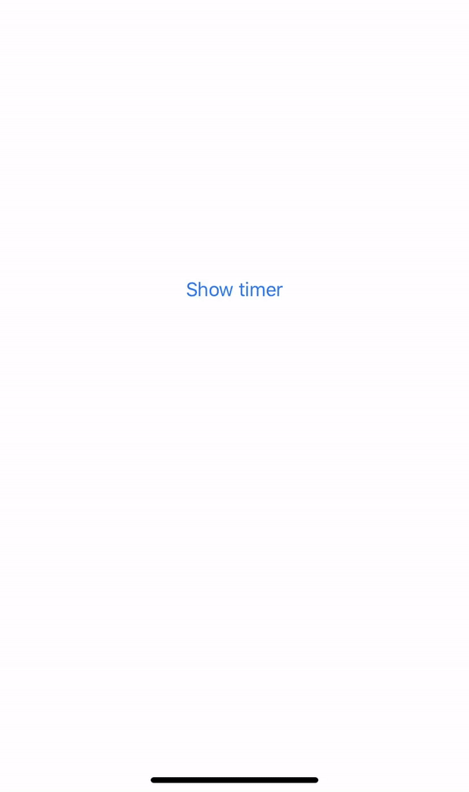

# TimerView

SwiftUI custom bottom timer.



### Usage:
Import TimerView to your project: `import TimerView`

You can change the backgound, the length of the timer and if it should vibrate at the end.

Use it inside a ZStack!

TimerView example:
```swift
 ZStack {
     if showingTimer {
         TimerView(showTimer: $showingTimer, timerValue: $time, backgroundColor: Color(UIColor.secondarySystemBackground), vibrationAtTheEnd: true)
     }
 }
```

### Installation:
Requirements: iOS 13 or later, Xcode 11 or later.

Simplest way to install is to use Swift Package Manager.
In Xcode got to `File -> Swift Packages -> Add Package Dependency` and paste inthe repo's url: `https://github.com/ViktorMaric/TimerView`
